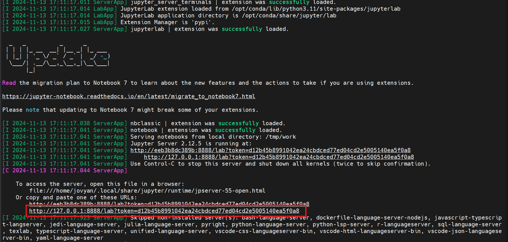
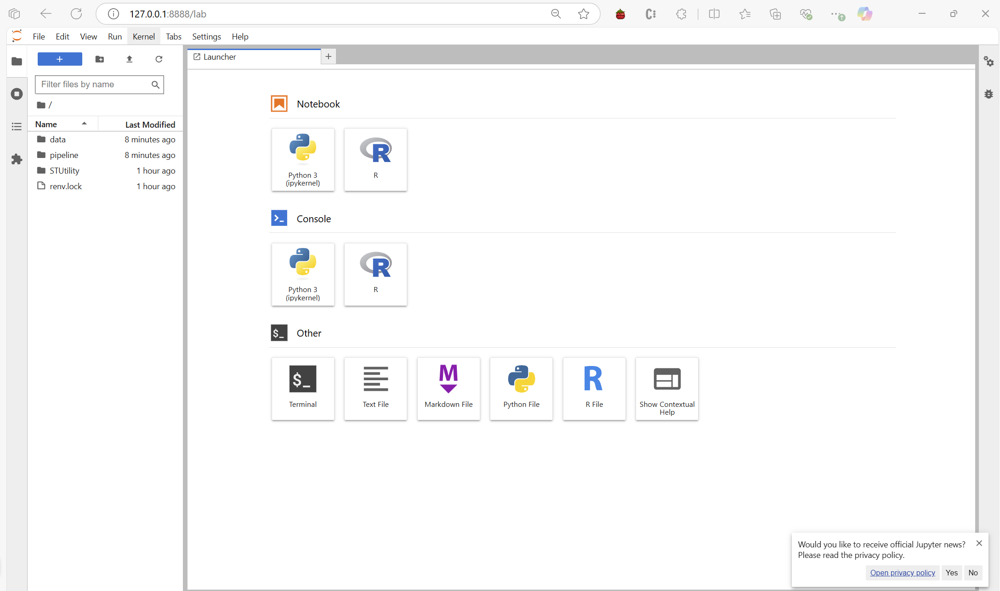

# User Guide
## Barley 4D Spatial Transcriptomics Pipeline 
This pipeline processes Visium SpaceRanger output to generate clustering as well as transcript abundance plots. 
It requires the following files from SpaceRanger
- *.h5 file
- filtered_feature_bc_matrix/features.tsv 
- spatial (a directory)
  - scalefactors_json.json
  - tissue_lowres_image.png
  - tissue_positions_list.csv


#### Download the pipeline
To access the pipeline, download it from this [repository](https://github.com/4D-Barley-Spatial-Transcriptomics/Barley-4D-Gene-Atlas-Public)

After downloading, you will find the following directories: 
- **pipeline**: Contains the R scripts and notebook that form the pipeline.
- **container**: Includes the Dockerfile, script to run the notebook's container (runJupyterDocker.sh), and R package version file (renv.lock).
- **utils**: Contains the necessary scripts to ensure the visualization application displays all required plots.

#### Install Docker
To run the pipeline, you'll need Docker. You can either install [Docker Desktop](https://docs.docker.com/desktop/) cor just the [Docker CLI](https://medium.com/devops-technical-notes-and-manuals/how-to-install-docker-on-ubuntu-22-04-b771fe57f3d2).

Docker Desktop includes both the CLI and a graphical user interface, while the CLI version provides only the command-line tools.

Once installed, you'll be able to build and run the container for the pipeline.

#### Build the Docker container
Before using the Docker container, you need to build it. Follow the steps below:
```
# Navigate to the directory containing the Dockerfile
cd JupyterNotebook/container

# Build the Docker container
sudo docker build .  -t analysis-pipeline:1.1.0 
```

This will build the container based on Dockerfile and tag it as analysis-pipeline:1.1.0.

### How to run the pipeline:

1. Navigate to the JupyterNotebook/container directory

2. Edit the runJupyterDocker.sh script by updating the following variables with the absolute path:

- DATA_DIR: Directory containing your input data
- PIPELINE_DIR: Directory where the pipeline is stored
- UTILS_DIR: Directory containing the necessary scripts for the visualization application
3. Run the Docker container:
`sudo bash runJupyterDocker.sh`
4. If you're running the pipeline on a remote Virtual Machine, set up SSH tunneling:
```
# Run the following command to forward the required port:
bash
ssh -L 888:localhost:8888 user@remote_server.com
```
5. Access the Jupyter Notebook:
Copy the URL that appears when the container starts and paste it into your browser.

    

    You should now see the landing page:

    

6. Navigate to the baseNotebook.ipynb:

    Inside the pipeline directory, you will find the baseNotebook.ipynb file. 
    This notebook contains detailed instructions and descriptions for each step of the pipeline.


